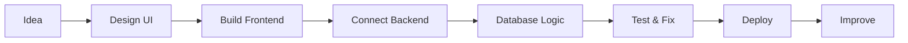

<div align="center">

<!-- ================= HERO / HEADER ================= -->


<!-- TYPING INTRO -->


<br/><br/>

<!-- BADGES -->


<br/><br/>

<!-- SOCIALS -->
<a href="https://github.com/reportJNG">
  
</a>
<a href="https://linkedin.com/in/hamza">
  
</a>
<a href="mailto:hamza@email.com">
  
</a>

<br/><br/>

> **“Build fast. Design clean. Improve every version.”**

</div>

---

<!-- ================= ABOUT ================= -->

##  About Me

```ts
const hamza = {
  username: "reportJNG",
  role: "Full-Stack Developer",
  location: "Algeria 🇩🇿",
  mainStack: ["Next.js", "React", "TypeScript", "PostgreSQL", "Prisma"],
  focus: "Building modern, clean, production-ready web apps",
  mindset: "Ship. Learn. Improve. Repeat.",
  currentProject: "Centre Nautique SONATRACH",
};
```

I enjoy building web applications that feel **fast**, **clean**, and **real** — not just demos.  
My current focus is full-stack development with **Next.js**, **TypeScript**, **PostgreSQL**, and modern UI systems.

---

<!-- ================= CURRENT FOCUS ================= -->

## 🚀 Current Focus

<table>
  <tr>
    <td width="33%" align="center">
      
      <h3>Full-Stack Apps</h3>
      <p>Building complete apps with frontend, backend, database, auth, and dashboards.</p>
    </td>
    <td width="33%" align="center">
      
      <h3>Database Systems</h3>
      <p>Designing structured databases using PostgreSQL, Prisma, SQL, and Merise logic.</p>
    </td>
    <td width="33%" align="center">
      
      <h3>Modern UI</h3>
      <p>Creating clean interfaces with animations, components, and smooth user experience.</p>
    </td>
  </tr>
</table>

---

<!-- ================= TECH STACK ================= -->

## 🧰 Tech Stack

<div align="center">

### Languages


### Frontend


### Backend & Database


### Tools


</div>

---

<!-- ================= FEATURED PROJECT ================= -->

## 🏗️ Featured Project

<div align="center">

<table>
  <tr>
    <td width="100%">
      <h3>🌊 Centre Nautique SONATRACH</h3>
      <p>
        A full-stack management system for subscriptions, members, schedules, invoices, reports, and role-based access control.
      </p>
      <p>
        
        
        
        
        
      </p>
    </td>
  </tr>
</table>

</div>

```ts
const centreNautique = {
  type: "Full-stack web application",
  features: [
    "Member registration",
    "Subscription management",
    "Schedule management",
    "Invoices and reports",
    "Secure role-based dashboard",
  ],
  stack: ["Next.js", "React", "TypeScript", "Prisma", "PostgreSQL", "Tailwind CSS"],
};
```

---

<!-- ================= GITHUB STATS ================= -->

## 📊 GitHub Analytics

<div align="center">


<br/><br/>


</div>

---

<!-- ================= ACTIVITY GRAPH ================= -->

## ⚡ Activity Graph

<div align="center">


</div>

---

<!-- ================= SNAKE ================= -->

## 🐍 Contribution Snake

<div align="center">

<picture>
  <source media="(prefers-color-scheme: dark)" srcset="https://raw.githubusercontent.com/reportJNG/reportJNG/output/snake-neon.svg" />
  <source media="(prefers-color-scheme: light)" srcset="https://raw.githubusercontent.com/reportJNG/reportJNG/output/snake.svg" />
  
</picture>

</div>

---

<!-- ================= WORKFLOW ================= -->

## 🧭 My Developer Workflow

<div align="center">



</div>

---

<!-- ================= LEARNING ================= -->

## 📚 Learning Path

<table>
  <tr>
    <td><b>Now</b></td>
    <td>Next.js, TypeScript, Prisma, PostgreSQL, clean dashboard architecture</td>
  </tr>
  <tr>
    <td><b>Improving</b></td>
    <td>System design, authentication, database optimization, production deployment</td>
  </tr>
  <tr>
    <td><b>Exploring</b></td>
    <td>UI animation, 2.5D web interfaces, developer tooling, open-source projects</td>
  </tr>
</table>

---

<!-- ================= MOTTO ================= -->

## 💡 Developer Mindset

<div align="center">

<table>
  <tr>
    <td align="center">⚡<br/><b>Fast</b><br/>Ship real progress</td>
    <td align="center">🎨<br/><b>Clean</b><br/>Design with purpose</td>
    <td align="center">🧠<br/><b>Smart</b><br/>Think before coding</td>
    <td align="center">🚀<br/><b>Better</b><br/>Improve every version</td>
  </tr>
</table>

</div>

---

<!-- ================= CONTACT ================= -->

## 🌐 Connect With Me

<div align="center">

<a href="https://github.com/reportJNG">
  
</a>
<a href="https://linkedin.com/in/hamza">
  
</a>
<a href="mailto:hamza@email.com">
  
</a>

</div>

---

<div align="center">


### ⭐ Thanks for visiting my profile

**Crafted with passion by `hamza · reportJNG`**

</div>
