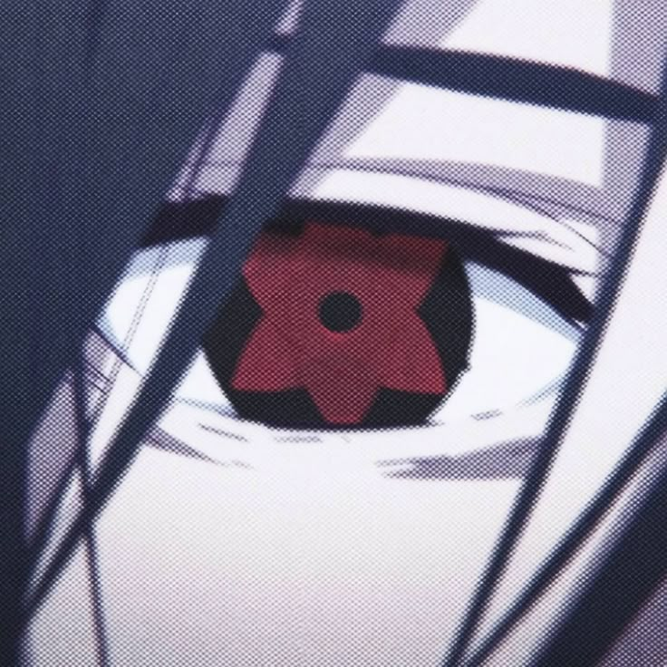
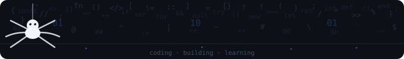

# Hamza Remali
**Full Stack & Mobile Developer 🇩🇿**

Web Applications &nbsp;·&nbsp; Mobile Applications &nbsp;·&nbsp; Desktop Applications &nbsp;·&nbsp; Automation Tools &nbsp;·&nbsp; Game Development

---

## 🛠️ Tech Stack

### Frontend

### Backend

### Game Development

### Tools

---

## Favorite Languages

&nbsp;&nbsp;&nbsp;

---

## 📫 Contact

&nbsp;

---

