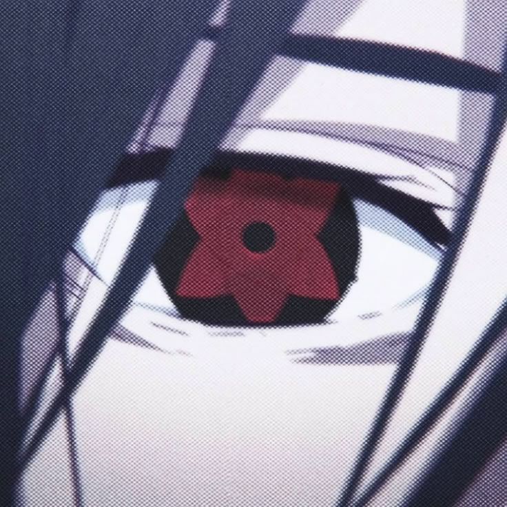
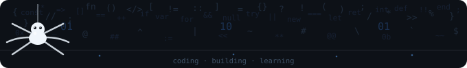

 

  

  <h1>Hamza Remali</h1>
  <strong>Full Stack &amp; Mobile Developer 🇩🇿</strong>

  

    Web Applications &nbsp;·&nbsp; Mobile Applications &nbsp;·&nbsp; Desktop Applications &nbsp;·&nbsp; Automation Tools &nbsp;·&nbsp; Game Development
  

---

  <h2>🛠️ Tech Stack</h2>

  <h3>Frontend</h3>
  

  <h3>Backend</h3>
  

  <h3>Game Development</h3>
  

  <h3>Tools</h3>
  

---

  

---

  

